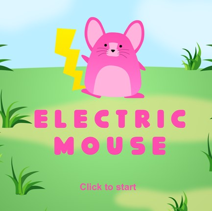
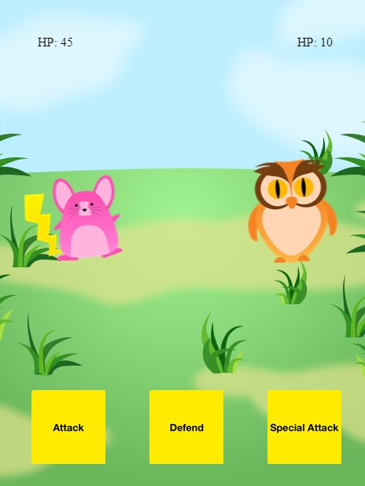

# Electric-Mouse

  ## Table of Contents

- [Table of Contents](#table-of-contents)
- [Deployment](#deployment)
- [User-Story](#user-story)
- [Description](#description)
- [Installation](#installation)
- [Usage](#usage)
- [Contributions](#contributions)
- [Questions](#questions)

 
  

  ---

  ## Deployment
  [https://austinslatey.github.io/Electric-mouse/](https://austinslatey.github.io/Electric-mouse/)

   

  ## User-Story
  - AS A USER I WANT to face a computer 
  
  - WHERE I can choose to Attack, Defend, or Special 
  
  - THEN to face a computer 
  
  - WHILE the computer's moves are the same

  - AND random 
 

  ## Description
  A Phaser.js in-browser game

  ## Installation
  Live Server Extention in VS Code. Clone repository and select open live server on the bottom right of the screen

  ## Usage
  To pratice skills using phaser.js conditional statements

  ## Contributions
  CodeCademy

  ## Questions

  If any questions arise..

  Visit my Github at: [https://github.com/austinslatey](https://github.com/austinslatey)

  Reach out to me by email: austinslater58@gmail.com
  
